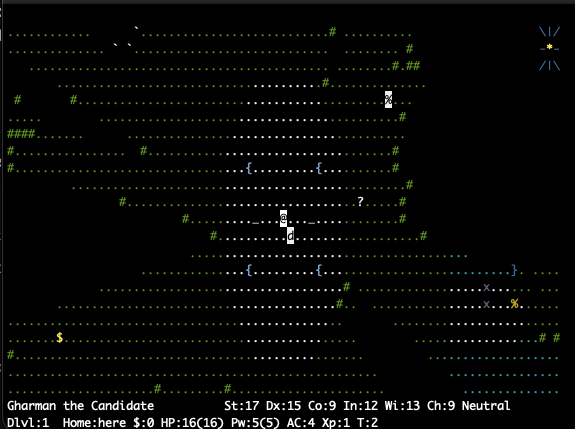
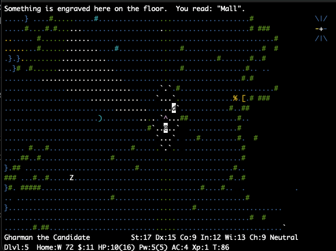
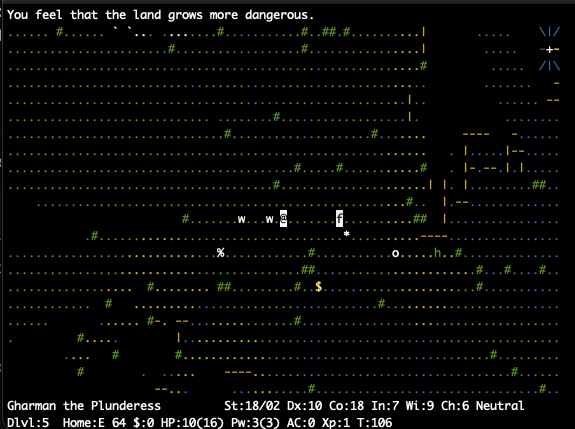

# NetHack: Open World

NetHack 5.0 (the successor to 3.7) with the Dungeons of Doom and Gehennom
replaced by one huge outdoor world. The further you walk from the centre,
the deeper you are. Every special level sits behind a ring of magic
portals at its usual depth, and you win by carrying the Amulet of Yendor
back to your god's high altar at the centre. The rest of NetHack is still
here and plays as usual, from character creation through the Mines,
Sokoban, the Quest, Medusa, the Castle, Gehennom and the invocation, with
the full command set.

It also adds roles, races, techniques, object materials and special
levels from Slash'EM, SlashTHEM, SpliceHack, Hack'EM, EvilHack and
xNetHack, plus a role and a race of its own. The [wiki](wiki/Home.md)
covers everything new or different in detail.

*The start: you stand on your god's high altar at the centre of the world,
between the high altars of the other two gods. You win by bringing the
Amulet back here, with no Elemental Planes to cross.*

*Each special level is behind a magic portal (`^`) in a circle of standing
stones, with its destination engraved beside it. This one leads to the
Mall.*

*Walking away from the centre takes you deeper. Crossing into the next
ring is like going downstairs, and the status line counts the way home
(`Home:E 64`).*

## Building and playing

The repository holds the source, not a built game. Build it first:

    source/NetHack-openworld/build.sh

This needs a C compiler, make and curses, and the first build downloads
Lua 5.4.8 from lua.org. The game goes into `game/`. The build has been
used on macOS; on Linux it uses NetHack's Linux build settings, which
haven't been tried with this variant yet. Then play with the `owhack`
launcher:

    ./owhack               start or resume a game
    ./owhack -u Name       play as Name
    ./owhack -s            high scores
    ./owhack -D            wizard mode (build.sh's sysconf allows whoever ran it)

To type just `owhack` from anywhere, symlink it onto your PATH, the way a
package manager installs `nethack`. From the top of the repository:

    ln -s "$PWD/owhack" /usr/local/bin/owhack

The game runs in a terminal (tty only), in colour, with number-pad
movement on by default (`number_pad:0` switches to vi-keys). The map fills
the window, so a bigger terminal shows more of the world. If there is a
`nethackrc` file next to `owhack`, the game reads it instead of
`~/.nethackrc`. Git ignores that file, and `--nethackrc=FILE`, or
`NETHACKOPTIONS` naming a file, overrides it. In the game, `?` then
"About the open world" explains how the world works.

Please report bugs at
[github.com/gharman/owhack/issues](https://github.com/gharman/owhack/issues),
not to the NetHack DevTeam, who can't fix this variant's bugs. The game
points there too, from `#bugreport` and `?` "Support information".

## What's different

The world ([The open world](wiki/Open_world.md),
[Portal rings](wiki/Portal_rings.md)):

* You start on your god's high altar in a plaza at the centre of the
  world. Around it the land is concentric rings 16 squares wide, and your
  ring is your depth (`Dlvl`), driving difficulty as dungeon depth does.
  The status line (`Home:NW 187`) and a compass rose on the map point home.
* There are no stairs and no rooms and corridors. The land is meadows,
  forests, hills, mountains, lakes, swamps, tundra, deserts and ruins,
  with roads, towns (shops, a temple, a watch), walled compounds for
  NetHack's special rooms, and vaults sealed in the mountains. Monsters
  more than about a screen away wait where they are.
* Each special level is a branch behind portals evenly spaced around the
  ring at its usual depth, and leaving one brings you back to the portal
  you used. Gehennom is the outermost rings, walled off by the Barrier;
  you get in through the Castle and the Valley as usual.
* You win by offering the Amulet on your god's high altar at the centre.
  There are no Elemental or Astral Planes.
* Level teleport moves you between rings, digging down only makes a pit,
  and detection and mapping cover your surroundings rather than the whole
  1700x1700 world.

Added:

* Roles: the Necromancer, Flame Mage and Ice Mage (Slash'EM), the Jedi
  (SlashTHEM), the Pirate (SpliceHack, Hack'EM), the Convict and Infidel
  (EvilHack), and the new [Cartographer](wiki/Cartographer.md).
* Races: the giant, centaur, illithid, tortle and draugr (EvilHack), the
  vampire, werewolf and doppelganger (Slash'EM), and the new
  [ghost](wiki/Ghost_race.md), which drifts through walls. See
  [Roles and races](wiki/Roles_and_races.md).
* [Techniques](wiki/Techniques.md) for every role but the Tourist, and for
  most races (`#technique`).
* Object materials from xNetHack, with EvilHack's rules: weapons and armor
  come in iron, steel, mithril, silver, copper, wood, glass and more, cold
  iron harms elves and copper harms fungi, and the mithril coats are gone
  now that mithril is a material.
* The extra special levels of Slash'EM, Hack'EM and EvilHack, among them
  One-eyed Sam's black market, Grund's Stronghold, Goblin Town, the Wyrm
  Caves, the alignment key quests, Frankenstein's Lab and lairs for four
  demon lords.
* From Hack'EM: shopkeeper services (`#chat`), inventory weights, training
  percentages in `#enhance`, and drain and psychic resistance.

[Differences from the source variants](wiki/Variant_differences.md) says
how each import was adapted and what was left out.

## Lineage and credits

This is a variant of NetHack 5.0.0, forked from the DevTeam's source
([github.com/NetHack/NetHack](https://github.com/NetHack/NetHack), branch
`NetHack-5.0`, commit `c1b1b08`, 2026-09-26), not from any other variant.
The features from the six variants above were ported from their source
code and rewritten for 5.0, since each is built on an older NetHack. The
open world, the Cartographer and the ghost are original.
[wiki/Lineage.md](wiki/Lineage.md) lists the exact versions and commits
used, and what came from each.

Lua 5.4.8 (MIT license), which runs the level scripts, is downloaded by
the build. Like NetHack and all six variants, this build is distributed
under the NetHack General Public License ([LICENSE](LICENSE)). Each NetHack
file changed for it says so in its header, and the git history dates
every change.

## Repository layout

    LICENSE           the NetHack General Public License
    owhack            launcher
    nethackrc         your options, if you make one (not in git)
    screenshots/      the pictures on this page
    wiki/             what is new or different (start at wiki/Home.md);
                      build.sh also makes HTML pages of it in game/wiki/
    game/             the installed game (not in git): owhack, nhdat,
                      sysconf, high scores, saves
    source/NetHack-openworld/
                      the source; its build.sh rebuilds and reinstalls
                      into game/, creating game/sysconf if it is missing
                      and never touching saves or scores

The source history starts with stock NetHack 5.0 plus a few hooks for an
automated test harness, tagged `nethack-5.0-baseline`, so this shows every
change made for the variant:

    git diff nethack-5.0-baseline HEAD:source/NetHack-openworld

Most of the open world is in `src/overworld.c` (world generation, rings,
portals, zones, towns, compass, monster dormancy) and
`include/openworld.h`. The other files it leans on most are `display.c`
and `win/tty/wintty.c` (the scrolling viewport), `vision.c`, `teleport.c`,
`do.c`, `mklev.c`, `dungeon.c`, `hack.c` (travel), `save.c` and
`restore.c` (compressed map saving) and `dat/dungeon.lua` (the dungeon
layout). With the imported roles, races and levels, about 150 of
NetHack's files are changed in all.
